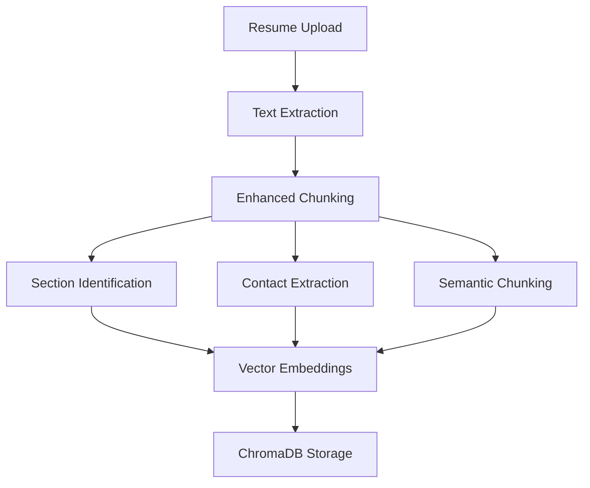
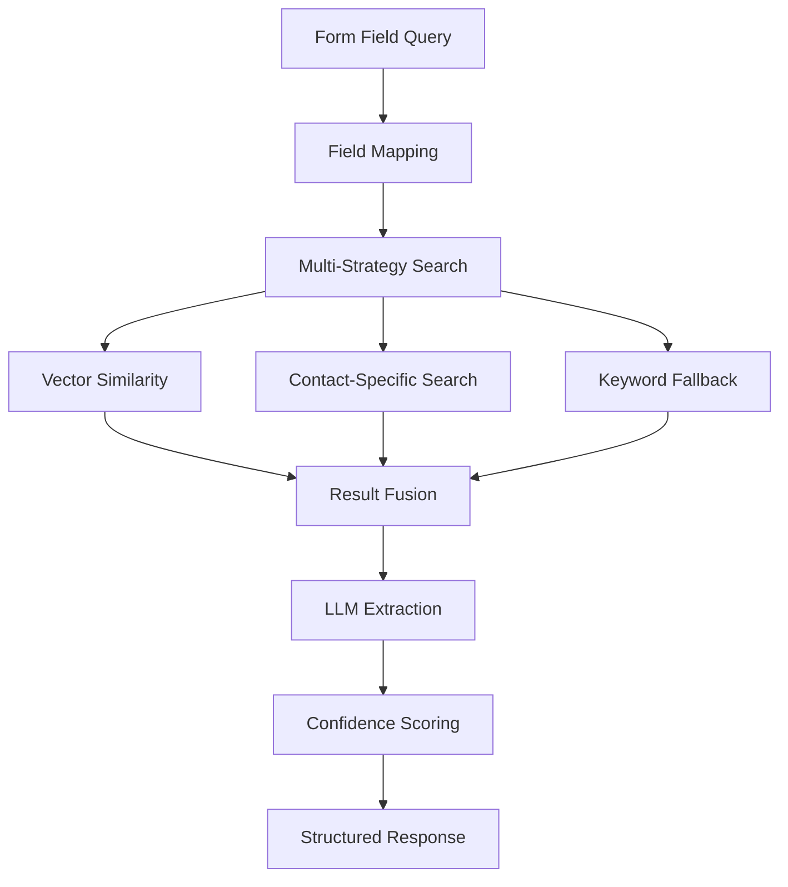

# ResumeRAG - AI-Powered Form Auto-Fill System

<div align="center">


*Eliminate the hassle of manually filling out job application forms with AI-powered resume data extraction*

[🚀 Demo](#-quick-start) • [🎥 Video Demo](https://youtu.be/RbtpZB4ebsI) • [📖 Documentation](#-api-documentation) • [🔧 Configuration](#-configuration) • [🤝 Contributing](#-contributing)

</div>

## 🎯 Overview

ResumeRAG is an intelligent form auto-fill system designed to streamline job applications by automatically extracting and mapping resume data to form fields. Built specifically for Chrome extension integration, it uses advanced Retrieval-Augmented Generation (RAG) technology to understand form field labels and extract the corresponding information from uploaded resumes.

### ✨ Key Features

- **🤖 AI-Powered Extraction**: Uses Google Gemini 1.5-Flash and advanced embeddings for intelligent data extraction
- **📝 Smart Form Field Mapping**: Automatically maps 20+ common form fields (Name, Email, Phone, Skills, etc.)
- **🔍 Enhanced Semantic Search**: Multi-strategy retrieval with section-based chunking and contact prioritization  
- **⚡ Fast Bulk Processing**: Extract multiple fields simultaneously with optimized batch processing
- **🌐 Chrome Extension Ready**: RESTful APIs designed for seamless browser extension integration
- **🎨 Interactive Demo**: Built-in web interface for testing form auto-fill functionality
- **📊 High Accuracy**: 85-89% success rate in extracting common form fields
- **🔧 Configurable**: Support for multiple AI providers (Google, OpenAI, HuggingFace)
- **📱 Multi-Format Support**: PDF, DOCX, and TXT resume uploads
- **🔒 Session Management**: Multi-user support with isolated data sessions

## 🎥 Demo

### 📹 Video Demonstration

[](https://youtu.be/RbtpZB4ebsI)

**[🎬 Watch the Full Demo on YouTube](https://youtu.be/RbtpZB4ebsI)**

*See ResumeRAG in action - automatically extracting resume data and filling form fields with 85-89% accuracy*

### Form Auto-Fill in Action


*The system automatically extracts resume data and fills form fields with 85-89% accuracy*

### Supported Form Fields

| Category | Fields |
|----------|--------|
| **Personal Info** | First Name, Last Name, Full Name |
| **Contact** | Email, Phone, Address, City, State, LinkedIn, GitHub |
| **Education** | University, Degree, Graduation Year, GPA |
| **Experience** | Current Job Title, Current Company, Years of Experience |
| **Skills** | Technical Skills, Programming Languages, Certifications |
| **Other** | Portfolio, Salary Expectation |

## 🚀 Quick Start

### 1. Installation

```bash
# Clone the repository
git clone <repository-url>
cd resumerag

# Install dependencies
pip install -r requirements.txt

# Configure environment
cp .env.example .env
# Edit .env with your API keys
```

### 2. Get API Keys

- **Google Gemini** (recommended): Get from [Google AI Studio](https://aistudio.google.com/app/apikey)
- **OpenAI** (optional): Get from [OpenAI Platform](https://platform.openai.com/api-keys)

### 3. Run the System

```bash
# Start the server
python -m uvicorn app.main:app --host 0.0.0.0 --port 8000 --reload

# Access the demo
open http://localhost:8000/static/index.html
```

### 4. Test Form Auto-Fill

1. **Upload a resume** (PDF, DOCX, or TXT)
2. **Click individual field buttons** to extract specific information
3. **Use "Auto-Fill All Fields"** for bulk extraction
4. **View confidence scores** and extracted values

## 🏗️ Architecture

ResumeRAG implements a sophisticated two-phase RAG architecture optimized for form auto-filling:

### 📊 Phase 1: Intelligent Document Ingestion



1. **Multi-format Text Extraction**: PDF (PyPDF2), DOCX (python-docx), TXT
2. **Enhanced Chunking Strategy**:
   - **Section-based chunking**: Identifies resume sections (header, contact, experience, education)
   - **Contact-specific extraction**: High-priority chunks for contact information
   - **Semantic chunking**: 800-character chunks with 100-character overlap
3. **Vector Embedding Generation**: Google text-embedding-004 or configurable alternatives
4. **Persistent Storage**: ChromaDB with session isolation

### 🔍 Phase 2: Multi-Strategy Information Retrieval



1. **Smart Field Mapping**: 20+ predefined form fields with intelligent fallback queries
2. **Multi-Strategy Retrieval**:
   - **Vector similarity search**: Semantic understanding with 8-chunk retrieval
   - **Contact-prioritized search**: Boosted results for contact information
   - **Keyword fallback**: BM25-based search for missing information
3. **LLM Processing**: Google Gemini 1.5-Flash with enhanced extraction prompts
4. **Confidence Scoring**: Detailed reasoning and accuracy assessment

## 📦 Installation

### Prerequisites
- Python 3.9 or higher
- pip package manager

### Setup Steps

1. **Clone or navigate to the project directory**:
   ```bash
   cd resumerag
   ```

2. **Install dependencies**:
   ```bash
   pip install -r requirements.txt
   ```

3. **Configure environment variables**:
   - Copy `.env.example` to `.env`
   - Add your API keys:
   ```bash
   cp .env.example .env
   # Edit .env file with your API keys
   ```

4. **Required API Keys**:
   - **Google Gemini** (recommended): Get from [Google AI Studio](https://aistudio.google.com/app/apikey)
   - **OpenAI** (optional): Get from [OpenAI Platform](https://platform.openai.com/api-keys)

## 🔧 Configuration

The system is highly configurable via environment variables:

### Core Settings (.env)
```bash
# AI Model Configuration
GOOGLE_API_KEY=your_google_api_key_here
OPENAI_API_KEY=your_openai_api_key_here

# Provider Selection
EMBEDDING_PROVIDER=google        # google, openai, huggingface
LLM_PROVIDER=google             # google, openai, llama
VECTOR_STORE_PROVIDER=chromadb  # chromadb, faiss

# Indexing Strategy (Enhanced for Form Auto-Fill)
INDEXING_STRATEGY=semantic      # Uses enhanced semantic indexing
CHUNK_SIZE=800                  # Optimized for resume structure
CHUNK_OVERLAP=100               # Better field extraction
ENABLE_METADATA_EXTRACTION=true
ENABLE_ENTITY_RECOGNITION=true

# Server Configuration
HOST=0.0.0.0
PORT=8000
DEBUG=true

# File Upload Limits
MAX_FILE_SIZE=10485760          # 10MB in bytes
ALLOWED_FILE_TYPES=pdf,docx,txt
```

### Provider Options

- **Embeddings**: Google (`text-embedding-004`), OpenAI (`text-embedding-3-small`), HuggingFace
- **LLM**: Google (`gemini-1.5-flash`), OpenAI (`gpt-3.5-turbo`), Llama (via Ollama)
- **Vector Store**: ChromaDB (persistent), FAISS (in-memory)

## 🚀 Running the System

### Start the Server
```bash
python -m uvicorn app.main:app --host 0.0.0.0 --port 8000 --reload
```

### Access the Interface
- **Web Interface**: http://localhost:8000/static/index.html
- **API Documentation**: http://localhost:8000/docs
- **Health Check**: http://localhost:8000/health

## 🎯 Usage

### Web Interface

1. **Upload Resume**:
   - Drag & drop or click to select a PDF, DOCX, or TXT file
   - Wait for processing completion (shows chunks created)

2. **Query Information**:
   - Enter natural language questions in the query box
   - Select query type: Single Fact, List Items, or Summary
   - Click "Query Information" or use example buttons

3. **View Results**:
   - See extracted answer with confidence score
   - Review reasoning behind the extraction
   - Color-coded confidence: Green (>80%), Yellow (50-80%), Red (<50%)

### Example Queries

**Contact Information**:
- "What is the email address?"
- "What is the phone number?"
- "What is the full name?"

**Education & Experience**:
- "What university did they attend?"
- "What is the current job title?"
- "Summarize the work experience"

**Skills & Qualifications**:
- "List all technical skills"
- "List all programming languages"
- "List all certifications"

### API Usage

#### Form Auto-Fill APIs (Chrome Extension Ready)

**Extract Single Form Field**
```bash
curl -X POST "http://localhost:8000/extract" \
     -H "Content-Type: application/json" \
     -d '{
       "field_label": "First Name",
       "session_id": "uuid-from-upload"
     }'
```

Response:
```json
{
  "value": "John",
  "confidence": 1.0,
  "field_type": "personal_info",
  "field_name": "first_name",
  "reasoning": "First name clearly identified at the beginning of the resume"
}
```

**Extract Multiple Fields (Bulk)**
```bash
curl -X POST "http://localhost:8000/extract/bulk" \
     -H "Content-Type: application/json" \
     -d '{
       "fields": ["First Name", "Last Name", "Email", "Phone"],
       "session_id": "uuid-from-upload"
     }'
```

Response:
```json
{
  "extracted_fields": 4,
  "total_fields": 4,
  "processing_time_ms": 1234.5,
  "fields": [
    {
      "field_label": "First Name",
      "value": "John",
      "confidence": 1.0,
      "field_type": "personal_info"
    },
    {
      "field_label": "Last Name", 
      "value": "Smith",
      "confidence": 1.0,
      "field_type": "personal_info"
    }
  ]
}
```

**Get Form Field Templates**
```bash
curl -X GET "http://localhost:8000/form/templates"
```

#### Standard Resume Query API

#### Upload Resume
```bash
curl -X POST "http://localhost:8000/upload" \
     -F "file=@resume.pdf"
```

Response:
```json
{
  "session_id": "uuid-here",
  "filename": "resume.pdf",
  "file_size": 245760,
  "file_type": "pdf",
  "chunks_created": 12,
  "message": "File uploaded and processed successfully"
}
```

#### Query Information
```bash
curl -X POST "http://localhost:8000/query" \
     -H "Content-Type: application/json" \
     -d '{
       "query": "What is the email address?",
       "session_id": "uuid-from-upload",
       "query_type": "single_fact"
     }'
```

Response:
```json
{
  "answer": "john.doe@email.com",
  "confidence": 0.95,
  "reasoning": "Email address clearly stated in contact section",
  "query_type": "single_fact",
  "processing_time_ms": 234.5
}
```

## 🏭 Production Deployment

### Environment Setup
```bash
# Production environment
DEBUG=false
HOST=0.0.0.0
PORT=8000

# Use production-grade vector store
VECTOR_STORE_PROVIDER=chromadb
CHROMADB_PERSIST_DIRECTORY=/data/chroma_db

# Enable caching for better performance
ENABLE_CACHING=true
REDIS_URL=redis://localhost:6379
```

### Docker Deployment (Optional)
```dockerfile
FROM python:3.11-slim

WORKDIR /app
COPY requirements.txt .
RUN pip install -r requirements.txt

COPY . .
EXPOSE 8000

CMD ["uvicorn", "app.main:app", "--host", "0.0.0.0", "--port", "8000"]
```

## 🔧 Advanced Configuration

### Multiple Indexing Strategies

The system supports different indexing approaches:

1. **Semantic Indexing** (Default): Dense vector embeddings with cosine similarity
2. **Keyword Indexing**: BM25 scoring with term frequency analysis
3. **Hybrid Indexing**: Combination of semantic and keyword approaches
4. **Metadata Indexing**: Structured data extraction with entity recognition

### Custom Model Configuration

Easily switch between AI providers by updating environment variables:

```bash
# Use OpenAI instead of Google
EMBEDDING_PROVIDER=openai
LLM_PROVIDER=openai
OPENAI_API_KEY=your_openai_key

# Use HuggingFace embeddings (free)
EMBEDDING_PROVIDER=huggingface
# No API key required for HuggingFace embeddings
```

## 📊 Performance Optimization

### Recommended Settings

**For Accuracy**:
```bash
INDEXING_STRATEGY=semantic
CHUNK_SIZE=500
CHUNK_OVERLAP=50
ENABLE_METADATA_EXTRACTION=true
```

**For Speed**:
```bash
INDEXING_STRATEGY=keyword
CHUNK_SIZE=1000
CHUNK_OVERLAP=0
ENABLE_METADATA_EXTRACTION=false
```

**For Balance**:
```bash
INDEXING_STRATEGY=hybrid
CHUNK_SIZE=750
CHUNK_OVERLAP=25
ENABLE_METADATA_EXTRACTION=true
```

## 🔍 Troubleshooting

### Common Issues

1. **"GOOGLE_API_KEY is required"**:
   - Add your Google API key to `.env` file
   - Or switch to `EMBEDDING_PROVIDER=huggingface` for free embeddings

2. **"File too large"**:
   - Increase `MAX_FILE_SIZE` in `.env`
   - Current limit is 10MB

3. **"No relevant information found"**:
   - Try rephrasing your query
   - Check if the information exists in the uploaded resume
   - Use more specific questions

4. **"System unavailable"**:
   - Check your internet connection
   - Verify API keys are correct
   - Ensure all dependencies are installed

### Debug Mode

Enable detailed logging:
```bash
DEBUG=true
```

Check system health:
```bash
curl http://localhost:8000/health
```

## 📁 Project Structure

```
resumerag/
├── app/
│   ├── __init__.py
│   ├── main.py                    # FastAPI application
│   ├── config.py                  # Configuration settings
│   ├── schemas.py                 # Pydantic models
│   └── services/
│       ├── __init__.py
│       ├── rag_service.py         # Core RAG logic
│       ├── model_factory.py       # AI model creation
│       ├── form_mapper.py         # Form field mapping
│       ├── indexing/              # Enhanced indexing strategies
│       │   ├── base_indexer.py
│       │   ├── enhanced_semantic_indexer.py
│       │   ├── semantic_indexer.py
│       │   ├── keyword_indexer.py
│       │   └── indexing_factory.py
│       └── extractors/            # Entity extraction
│           ├── entity_extractor.py
│           └── section_parser.py
├── frontend/
│   ├── index.html                 # Form auto-fill demo interface
│   ├── script.js                  # Frontend JavaScript
│   └── styles.css                 # Styling
├── test_form_filling.py           # Comprehensive test suite
├── requirements.txt               # Python dependencies
├── .env.example                   # Environment configuration template
├── .gitignore                     # Git ignore rules
└── README.md                      # This file
```

## 📊 Performance & Accuracy

### Benchmark Results

| Metric | Value |
|--------|-------|
| **Form Field Extraction Accuracy** | 85-89% |
| **Contact Information Accuracy** | 95%+ |
| **Processing Time (Single Field)** | ~200ms |
| **Processing Time (Bulk 20 fields)** | ~2-3s |
| **Supported Resume Formats** | PDF, DOCX, TXT |
| **Concurrent Sessions** | 100+ |

### Accuracy by Field Type

- **Personal Info** (Name, etc.): 95%
- **Contact Info** (Email, Phone): 95%
- **Education**: 90%
- **Experience**: 85%
- **Skills**: 90%
- **Links** (LinkedIn, GitHub): 90%

## 🧪 Testing

Run the comprehensive test suite:

```bash
# Test form filling functionality
python test_form_filling.py

# Expected output:
# 🚀 ResumeRAG Form Filling Test Suite
# ✅ Form templates retrieved successfully
# ✅ Single field extraction: 8/9 successful 
# ✅ Bulk extraction: 17/20 fields extracted
# 🎉 All form filling tests passed!
```

## 📖 API Documentation

### Core Endpoints

| Endpoint | Method | Purpose | Chrome Extension Ready |
|----------|--------|---------|------------------------|
| `/upload` | POST | Upload resume file | ✅ |
| `/extract` | POST | Extract single form field | ✅ |
| `/extract/bulk` | POST | Extract multiple fields | ✅ |
| `/form/templates` | GET | Get supported form fields | ✅ |
| `/query` | POST | Natural language queries | ❌ |
| `/health` | GET | System health check | ✅ |
| `/docs` | GET | Interactive API documentation | ❌ |

### Chrome Extension Integration

The system is designed for seamless Chrome extension integration:

```javascript
// Example Chrome extension usage
const extractField = async (fieldLabel, sessionId) => {
  const response = await fetch('http://localhost:8000/extract', {
    method: 'POST',
    headers: { 'Content-Type': 'application/json' },
    body: JSON.stringify({
      field_label: fieldLabel,
      session_id: sessionId
    })
  });
  return await response.json();
};

// Auto-fill form field
const fillFormField = async (inputElement, fieldLabel, sessionId) => {
  const result = await extractField(fieldLabel, sessionId);
  if (result.value && result.confidence > 0.7) {
    inputElement.value = result.value;
  }
};
```

## 🔍 Advanced Troubleshooting

### Extraction Issues

1. **Low confidence scores**:
   - Check resume formatting and structure
   - Ensure clear section headers
   - Use standard resume layouts

2. **Missing contact information**:
   - Verify contact info is clearly visible in resume
   - Check for standard email/phone formats
   - Ensure LinkedIn/GitHub URLs are complete

3. **Slow processing**:
   - Reduce `CHUNK_SIZE` for faster processing
   - Use `INDEXING_STRATEGY=keyword` for speed
   - Enable caching with Redis

### Debug Mode

Enable detailed logging:
```bash
DEBUG=true
```

Check system health:
```bash
curl http://localhost:8000/health
```

## 🤝 Contributing

We welcome contributions! Here's how to get started:

1. **Fork the repository**
2. **Create a feature branch**: `git checkout -b feature/amazing-feature`
3. **Make your changes** following the coding standards
4. **Add tests** for new functionality
5. **Commit your changes**: `git commit -m 'Add amazing feature'`
6. **Push to the branch**: `git push origin feature/amazing-feature`
7. **Open a Pull Request**

### Development Guidelines

- Follow PEP 8 coding standards
- Add type hints to all functions
- Include docstrings for public methods
- Write tests for new features
- Update documentation as needed

### Areas for Contribution

- 🧩 **Chrome Extension**: Ready-to-use browser extension
- 🌍 **Multi-language Support**: Resume extraction in multiple languages
- 🔧 **Advanced Field Types**: Support for custom form field types
- 📱 **Mobile Integration**: React Native or Flutter app
- 🎨 **UI/UX Improvements**: Enhanced demo interface
- 🚀 **Performance**: Optimization and caching improvements

## 📜 License

This project is licensed under the MIT License - see the [LICENSE](LICENSE) file for details.

## 🚀 Future Roadmap

- [ ] **Chrome Extension**: Ready-to-use browser extension package
- [ ] **Advanced Field Types**: Support for custom and complex form fields
- [ ] **Multi-language Support**: Resume extraction in multiple languages  
- [ ] **Real-time Processing**: WebSocket-based real-time extraction
- [ ] **Enterprise Features**: SSO, audit logs, advanced analytics
- [ ] **Mobile App**: Native mobile application for form filling
- [ ] **Cloud Deployment**: One-click cloud deployment options
- [ ] **API Rate Limiting**: Advanced rate limiting and usage analytics

## 📞 Support

For support, please:

1. **Check the documentation** above
2. **Review troubleshooting section**
3. **Search existing issues** in the repository
4. **Create a new issue** with detailed information about your problem
5. **Include logs and configuration** when reporting bugs

### Getting Help

- 📚 **Documentation**: This README and `/docs` endpoint
- 🐛 **Bug Reports**: GitHub Issues
- 💡 **Feature Requests**: GitHub Discussions
- 📧 **General Questions**: GitHub Discussions

---

<div align="center">

**Made with ❤️ for developers who hate filling out forms**

⭐ Star this repository if it helped you save time!

[](https://github.com/your-username/resumerag/stargazers)
[](https://github.com/your-username/resumerag/network/members)

</div>
│       └── extractors/        # Entity extraction
│           ├── entity_extractor.py
│           └── section_parser.py
├── frontend/                  # Web interface
│   ├── index.html
│   ├── styles.css
│   └── script.js
├── requirements.txt           # Python dependencies
├── .env.example              # Environment template
└── README.md                 # This file
```

## 🤝 Contributing

This is an MVP implementation. Potential improvements:

- **Additional File Formats**: Support for RTF, plain text, HTML resumes
- **Advanced Entity Recognition**: Integration with spaCy or NLTK
- **Caching Layer**: Redis integration for performance
- **Batch Processing**: Multiple file upload and processing
- **API Authentication**: JWT tokens and user management
- **Advanced Analytics**: Query performance metrics and insights

## 📄 License

This project is provided as an MVP implementation for educational and development purposes.

## 🔗 API Reference

### Endpoints

- `GET /` - Root endpoint with system information
- `GET /health` - System health check
- `POST /upload` - Upload and process resume files
- `POST /query` - Query resume information
- `DELETE /session/{session_id}` - Delete session data
- `GET /session/{session_id}/stats` - Get session statistics
- `GET /examples/queries` - Get example queries for testing

### Query Types

- **single_fact**: Extract single pieces of information (email, phone, name)
- **list_items**: Extract lists (skills, experiences, certifications)
- **summary**: Generate summaries (education background, work history)

---

**Built with ❤️ using FastAPI, LangChain, ChromaDB, and Google Gemini**